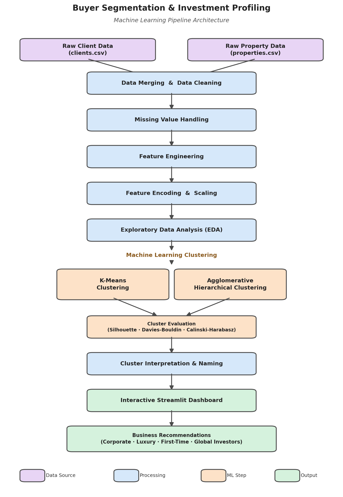
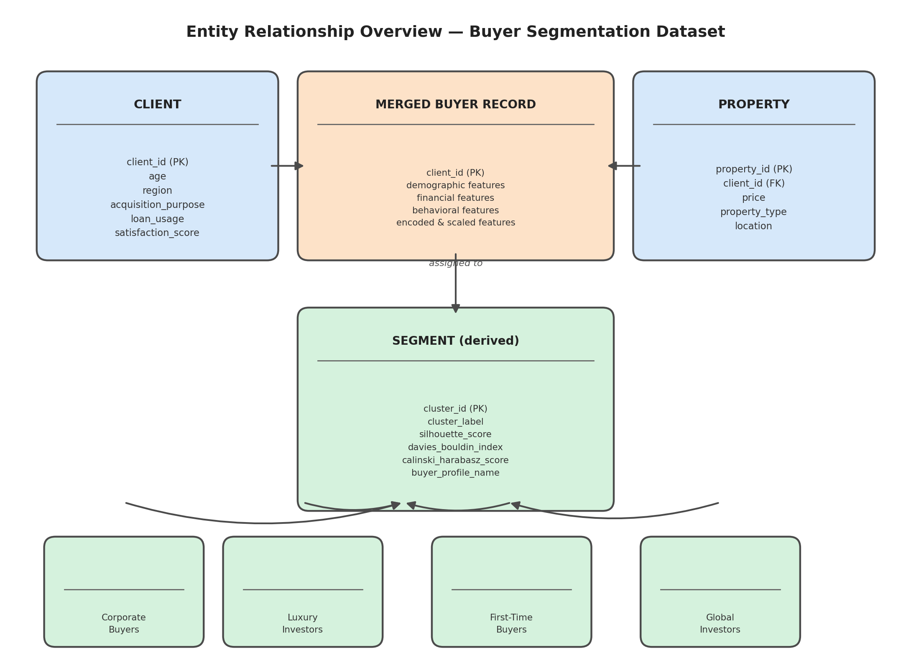

<div align="center">

# 🏡 Machine Learning Based Buyer Segmentation & Investment Profiling for Real Estate Market Intelligence

### A Data Analytics, Clustering & Business Intelligence Project on Real Estate Buyer Behavior

[](https://www.python.org/)
[](https://streamlit.io/)
[](https://scikit-learn.org/)
[](#-license)
[]()

**End-to-end unsupervised machine learning workflow — from raw client and property data cleaning to clustering, cluster evaluation, business profiling, and an interactive dashboard — built to segment real estate buyers and uncover investment behavior patterns.**

[🌐 Live Dashboard](https://ml-real-estate-analytics-fyqdw6myu7wmezt3wnvbm5.streamlit.app/) · [📂 Project Structure](#-project-structure) · [🤖 ML Workflow](#-phase-6--machine-learning-clustering) · [🚀 Getting Started](#-how-to-run-the-project)

</div>

---

## 📖 Project Overview

Understanding buyer behavior is critical for real estate companies aiming to target the right customers, design better marketing strategies, and identify high-value investment opportunities. Without segmentation, businesses treat all buyers the same — missing out on tailored engagement for luxury investors, corporate buyers, first-time buyers, and global investors.

This project applies **unsupervised Machine Learning** to real estate client and property data to answer key business questions such as:

- What natural segments exist among real estate buyers?
- Which buyers behave like investors versus end-use purchasers?
- How do age, region, loan usage, and satisfaction relate to buying behavior?
- Which clustering approach best captures buyer structure?
- How can these segments guide marketing and investment strategy?

This project was developed as part of the **Unified Mentor Internship**, in collaboration with **Parcl Co. Limited**, and converts raw client/property records into actionable buyer segments and investment profiles.

---

## 🌐 Live Dashboard

🚀 Explore the live interactive dashboard here:

**👉 [ml-real-estate-analytics-fyqdw6myu7wmezt3wnvbm5.streamlit.app](https://ml-real-estate-analytics-fyqdw6myu7wmezt3wnvbm5.streamlit.app/)**

---

## 🎯 Project Objectives

<table>
<tr>
<td valign="top" width="50%">

**Business Objectives**
- Understand real estate buyer behavior
- Segment buyers into meaningful investment profiles
- Identify high-value / luxury investors
- Improve marketing targeting strategy
- Support data-driven investment decisions
- Provide geographic and demographic buyer insights

</td>
<td valign="top" width="50%">

**Technical Objectives**
- Clean and merge multi-source datasets
- Engineer and encode behavioral features
- Apply feature scaling for clustering
- Build and compare clustering algorithms
- Evaluate cluster quality with multiple metrics
- Deliver insights through an interactive dashboard

</td>
</tr>
</table>

---

## 🏗 Project Architecture

The pipeline flows through four layers — data preparation, exploratory analysis, machine learning clustering, and delivery (dashboard + profiles) — as shown below.



<details>
<summary>Text-only version</summary>

```text
Raw Client Data ──┐
                   ├──▶ Data Merging ──▶ Data Cleaning
Raw Property Data ─┘
                            │
                            ▼
                 Missing Value Handling
                            │
                            ▼
                    Feature Engineering
                            │
                            ▼
              Feature Encoding & Scaling
                            │
                            ▼
                 Exploratory Data Analysis
                            │
                            ▼
                  Machine Learning Clustering
                   ├─ K-Means Clustering
                   └─ Agglomerative Hierarchical Clustering
                            │
                            ▼
                    Cluster Evaluation
                            │
                            ▼
                Cluster Interpretation & Naming
                            │
                            ▼
                  Interactive Dashboard
                            │
                            ▼
              Business Recommendations
```

</details>

---

## 🗂 Entity Relationship Overview

The dataset is conceptually organized around two source tables — **Clients** and **Properties** — merged into a single analytical dataset, which is then transformed into a derived **Segment/Cluster** entity for downstream business profiling.



<details>
<summary>Text-only version</summary>

```text
Clients.csv ──┐
              ├──▶ cleaned_merged_data.csv ──▶ final_segmented_data.csv
Properties.csv┘                                        │
                                                         ▼
                                          cluster_summary.csv
                                          cluster_naming_profile.csv
                                          cluster_evaluation_metrics.csv
```

</details>

---

## 📂 Project Structure

```text
Buyer-Segmentation/
│
├── buyer_segmentation_pipeline.py
├── eda_analysis.py
├── app.py
│
├── clients.csv
├── properties.csv
│
├── cleaned_merged_data.csv
├── final_segmented_data.csv
├── cluster_summary.csv
├── cluster_naming_profile.csv
├── cluster_evaluation_metrics.csv
│
├── elbow_method.png
├── pca_kmeans_clusters.png
├── pca_hierarchical_clusters.png
├── hierarchical_dendrogram.png
│
└── README.md
```

---

## 🔍 Phase 1 — Data Cleaning & Merging

The first stage transforms two raw, separate datasets into a single reliable analytical dataset.

**Tasks Performed**
- Dataset inspection (clients & properties)
- Missing value analysis
- Duplicate record detection
- Key-based dataset merging
- Data type validation and conversion
- Data consistency checks

**Output:** `cleaned_merged_data.csv`

---

## ⚙️ Phase 2 — Feature Engineering, Encoding & Scaling

Business-oriented features are generated and prepared for clustering algorithms.

| Category | Features Prepared |
|---|---|
| **Demographic** | Age Groups · Region · Acquisition Purpose |
| **Financial** | Loan Usage · Investment Indicators |
| **Behavioral** | Satisfaction Score · Buyer Activity Patterns |
| **Preprocessing** | Categorical Encoding · Feature Scaling (Standardization) |

**Output:** Model-ready feature set for clustering

---

## 📊 Phase 3 — Exploratory Data Analysis

Comprehensive EDA is performed to understand buyer patterns before clustering.

| Category | Analysis Performed |
|---|---|
| **Demographics** | Age distribution · Region-wise buyer distribution |
| **Behavior** | Satisfaction distribution · Acquisition purpose analysis |
| **Financial** | Loan analysis · Correlation heatmap |
| **Visualization** | Distribution plots · Correlation heatmap |

**Deliverables:** high-quality visualizations, buyer behavior insights, correlation analysis.

---

## 🧩 Phase 4 — Cluster Determination

Before final clustering, the optimal number of clusters is determined and validated visually.

**Techniques Used:** Elbow Method · Hierarchical Dendrogram

**Outputs:** `elbow_method.png` · `hierarchical_dendrogram.png`

---

## 🤖 Phase 5 — Machine Learning (Clustering)

Two unsupervised clustering algorithms are trained and compared to identify natural buyer segments.

### Algorithms
- **K-Means Clustering**
- **Agglomerative Hierarchical Clustering**

### Evaluation Metrics
| Metric | Purpose |
|---|---|
| Silhouette Score | Measures cluster separation and cohesion |
| Davies-Bouldin Index | Measures average similarity between clusters (lower is better) |
| Calinski-Harabasz Score | Measures ratio of between-cluster to within-cluster dispersion |

**Outputs:** `cluster_evaluation_metrics.csv` · `pca_kmeans_clusters.png` · `pca_hierarchical_clusters.png`

---

## 🏷 Phase 6 — Cluster Interpretation & Buyer Profiling

Each resulting cluster is interpreted and mapped to a business-friendly buyer segment.

**Identified Buyer Segments**
- 🏢 Corporate Buyers
- 💎 Luxury Investors
- 🏠 First-Time Buyers
- 🌍 Global Investors

**Outputs:** `cluster_summary.csv` · `cluster_naming_profile.csv` · `final_segmented_data.csv`

---

## 📈 Phase 7 — Interactive Streamlit Dashboard

An interactive business intelligence dashboard built with Streamlit.

**Dashboard Features**
- **Buyer Segmentation Overview** — high-level segment KPIs
- **Investor Behavior Dashboard** — investment-focused insights
- **Geographic Buyer Analysis** — region-wise buyer distribution
- **Segment Summary Cards** — quick-glance segment stats
- **Segment Insights Panel** — detailed behavioral insights
- **Recommended Buyer Segments** — targeting recommendations
- **Cluster Evaluation Metrics** — model quality transparency
- **PCA Cluster Visualization** — 2D visual representation of clusters

**Run locally:**
```bash
python -m streamlit run app.py
```

---

## 🛠 Technologies Used

| Category | Tools |
|---|---|
| **Language** | Python |
| **Data Analysis** | Pandas, NumPy |
| **Visualization** | Matplotlib, Seaborn, Plotly |
| **Dashboard** | Streamlit |
| **Machine Learning** | Scikit-Learn, SciPy |

---

## 🚀 How to Run the Project

**1. Clone the repository**
```bash
git clone https://github.com/satyam-ssingh/Buyer-Segmentation
cd Buyer-Segmentation
```

**2. Install dependencies**
```bash
pip install pandas numpy matplotlib seaborn scikit-learn plotly streamlit scipy
```

**3. Run the ML pipeline**
```bash
python buyer_segmentation_pipeline.py
```

**4. Run the EDA**
```bash
python eda_analysis.py
```

**5. Launch the dashboard**
```bash
python -m streamlit run app.py
```

---

## 📁 Output Files

| File | Description |
|---|---|
| `cleaned_merged_data.csv` | Cleaned and merged client-property dataset |
| `final_segmented_data.csv` | Final dataset with assigned buyer segments |
| `cluster_summary.csv` | Statistical summary per cluster |
| `cluster_naming_profile.csv` | Business-friendly names mapped to clusters |
| `cluster_evaluation_metrics.csv` | Silhouette, Davies-Bouldin, Calinski-Harabasz scores |
| `elbow_method.png` | Optimal cluster count visualization |
| `pca_kmeans_clusters.png` | PCA visualization of K-Means clusters |
| `pca_hierarchical_clusters.png` | PCA visualization of hierarchical clusters |
| `hierarchical_dendrogram.png` | Dendrogram of hierarchical clustering |

---

## 📌 Key Outcomes

- ✅ End-to-end unsupervised ML pipeline
- ✅ Multi-source data cleaning and merging
- ✅ Buyer segmentation using K-Means & Hierarchical Clustering
- ✅ Cluster quality evaluation with multiple metrics
- ✅ Business-friendly buyer profile naming
- ✅ Interactive dashboard development
- ✅ Geographic and behavioral buyer insights
- ✅ Actionable marketing & investment recommendations

---

## 💡 Business Benefits

- Customer Segmentation
- Investment Profiling
- Buyer Behavior Analysis
- Marketing Strategy Improvement
- Data-driven Decision Making
- Real Estate Market Intelligence

---

## 👨‍💻 Author

**Satyam Kumar Singh**
*BCA Student · Data Analytics · Machine Learning · Business Intelligence*

Unified Mentor Internship · Project Partner: **Parcl Co. Limited**

📧 satyamsinghb45@gmail.com

---

## 📄 License

This project is developed for educational and internship purposes.

---

<div align="center">

⭐ **If you found this project useful, consider giving the repository a star.**

</div>
